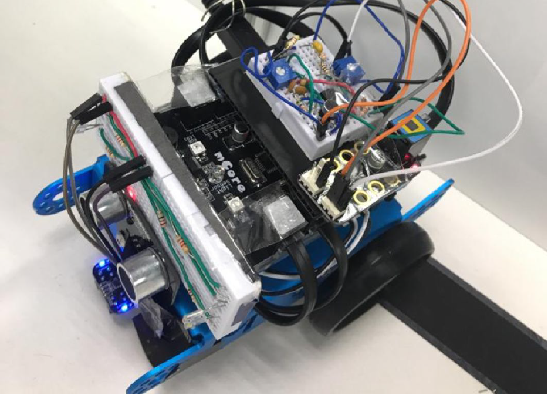

Requirements to be met by the mBot:

1) The mBot must be able to move as required.
- using software-controlled DC motors
- forward, left, right, U-turn (combinations: left+left, right+right)
- identify maximum possible speed during the different movements

2) The mBot must not bump into any wall. 
- make use of front ultrasonic sensor x 1, IR side sensor x 2
- should have none - extremely small delay in between checks
- quick & effective correction for immediate collisions
- slow(er) & gentle corrections for eventual collisions

3) Solve waypoint challenges
- identify black strip (4 * 21 cm) and stop accurately (maximise speed while allowing for accurate braking)
- solve challenge at 14 cm height above mBot

  3i) Colour-based challenge
  - using 2 RGB LEDs + LDR
  - 5 + 1 cases (all moves + black colour for end)

  3ii) Sound-based challenge
  - using sound detectors (built by us)
  - 3 cases (only basic moves)

4) Accurately identify the end of maze
  - can make it part of colour-based challenge (with end being the last check as it only occurs once)
  - play victory song - mBot play despacito (kahoot theme remix)

In general:
  - short-circuit conditional statements (the most frequent case should terminate as early as possible)
  - comment non-obvious code
  
---

Turning specifications:

Distance between middle of wheels = 116 mm
Wheel Circumference = 64pi mm
Distance to be covered by each wheel for 90 deg turn = 29pi mm

